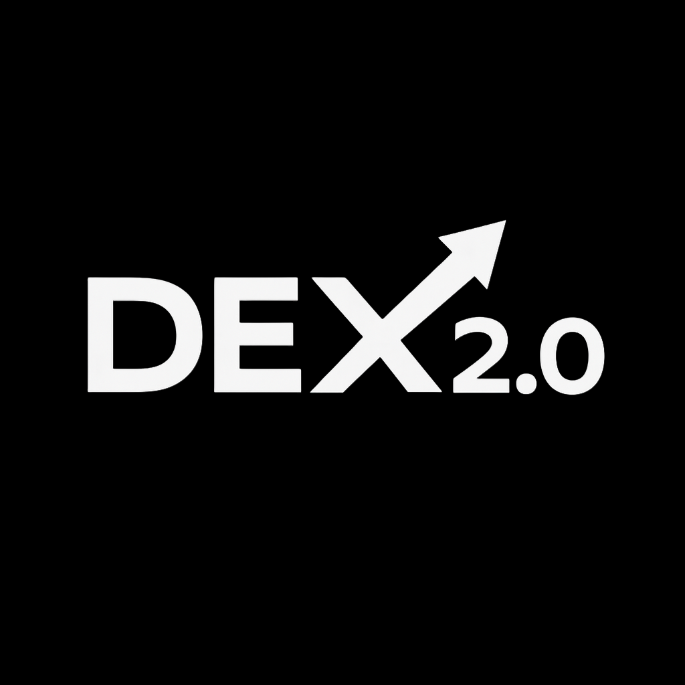

# DEX Screener - Token-2022 Analytics & Trading Platform

<div align="center">
  
</div>

A modern mobile application built with React Native and Expo that provides real-time analytics and trading capabilities for Token-2022 tokens on the Solana blockchain.

## 🚀 Features

### Token-2022 Program Features
- **Transfer Hooks**: Programmable token transfers with custom logic
- **Confidential Transfers**: Private token transfers with encryption
- **Metadata Pointers**: Dynamic metadata linked to external sources
- **Advanced Mint Management**: Full control over token creation and management

### Mobile App Features
- **Dark Theme UI**: Modern black-themed interface with Space Grotesk fonts
- **Floating Navigation**: Custom animated bottom navigation bar
- **Wallet Integration**: Seamless wallet connection and management
- **Real-time Analytics**: Live market data and trading insights
- **Portfolio Management**: Track and manage Token-2022 assets
- **Airdrop Support**: Easy SOL airdrop requests for testing

## 🏗️ Project Structure

```
dex2_0/
├── app/                          # Expo Router app directory
│   ├── (tabs)/                   # Tab navigation screens
│   │   ├── index.tsx            # Home screen
│   │   ├── portfolio.tsx        # Portfolio management
│   │   ├── search.tsx           # Token search
│   │   └── settings.tsx         # App settings
│   ├── sign-in.tsx              # Wallet connection screen
│   └── _layout.tsx              # Root layout
├── components/                   # Reusable UI components
│   ├── app-theme.tsx           # Theme configuration
│   ├── app-providers.tsx       # Context providers
│   └── auth/                   # Authentication components
├── src/
│   ├── context/
│   │   └── AppContext.tsx      # Main app context
│   ├── services/
│   │   ├── WalletService.ts    # Wallet management
│   │   ├── DEXService.ts       # DEX integration
│   │   └── Token2022Service.ts # Token-2022 operations
│   └── screens/                # Screen components
├── programs/
│   └── token-2022/             # Solana program
│       ├── src/
│       │   └── lib.rs          # Token-2022 smart contract
│       └── Cargo.toml          # Rust dependencies
├── assets/
│   └── fonts/                  # Space Grotesk fonts
└── android/                    # Android configuration
```

## 🎨 Design System

### Colors
- **Primary**: `#ffffff` (White for active elements)
- **Background**: `#000000` (Pure black)
- **Surface**: `#1a1a1a` (Dark gray for cards)
- **Text**: `#ffffff` (White text)
- **Muted**: `#666666` (Gray for secondary text)
- **Success**: `#10b981` (Green)
- **Error**: `#ef4444` (Red)
- **Warning**: `#f59e0b` (Orange)
- **Accent**: `#6366f1` (Indigo)

### Typography
- **Font Family**: Space Grotesk
- **Weights**: Regular, SemiBold, Bold
- **Usage**: Consistent typography throughout the app

## 🔧 Smart Contract Features

### Token-2022 Program (`programs/token-2022/src/lib.rs`)

#### Core Functions
- `initialize_mint`: Create new Token-2022 mints with advanced features
- `create_account`: Create Token-2022 accounts with transfer hook support
- `transfer_with_hook`: Execute transfers with custom logic
- `enable_confidential_transfers`: Enable private transfers
- `confidential_transfer`: Perform encrypted transfers
- `set_metadata_pointer`: Configure dynamic metadata
- `mint_to`: Mint new tokens
- `burn`: Burn tokens

#### Advanced Features
1. **Transfer Hooks**: Custom logic executed on every transfer
2. **Confidential Transfers**: Encrypted token transfers
3. **Metadata Pointers**: Dynamic metadata from external sources
4. **Event Tracking**: Comprehensive event logging
5. **Error Handling**: Robust error management

## 🚀 Getting Started

### Prerequisites
- Node.js 18+ 
- Yarn or npm
- Expo CLI
- Rust and Cargo (for smart contract development)
- Solana CLI tools

### Installation

1. **Clone the repository**
   ```bash
   git clone <repository-url>
   cd dex2_0
   ```

2. **Install dependencies**
   ```bash
   yarn install
   ```

3. **Install Rust dependencies (for smart contract)**
   ```bash
   cd programs/token-2022
   cargo build
   cd ../..
   ```

4. **Start the development server**
   ```bash
   yarn start
   ```

### Environment Setup

1. **Solana Configuration**
   ```bash
   solana config set --url devnet
   ```

2. **Build the smart contract**
   ```bash
   anchor build
   ```

3. **Deploy the program**
   ```bash
   anchor deploy
   ```

## 📱 App Usage

### Wallet Connection
1. Open the app
2. Tap "Connect Demo Wallet" for testing
3. Or import a private key for production use
4. Request SOL airdrop for testing

### Token-2022 Features
1. **Create Tokens**: Initialize new Token-2022 mints
2. **Transfer Hooks**: Set custom transfer logic
3. **Confidential Transfers**: Enable private transfers
4. **Metadata Management**: Configure dynamic metadata
5. **Portfolio Tracking**: Monitor Token-2022 assets

### Navigation
- **Home**: Market overview and trending tokens
- **Search**: Find and analyze tokens
- **Portfolio**: Manage your Token-2022 assets
- **Settings**: App configuration

## 🔒 Security Features

### Smart Contract Security
- Comprehensive input validation
- Authority checks for all operations
- Secure transfer hook execution
- Confidential transfer encryption
- Event logging for audit trails

### Mobile App Security
- Secure wallet key management
- Encrypted storage for sensitive data
- Network security with HTTPS
- Input sanitization and validation

## 🧪 Testing

### Smart Contract Tests
```bash
cd programs/token-2022
cargo test
```

### Mobile App Tests
```bash
yarn test
```

### Integration Tests
```bash
yarn test:integration
```

## 📦 Deployment

### Smart Contract Deployment
1. Build the program
   ```bash
   anchor build
   ```

2. Deploy to devnet
   ```bash
   anchor deploy --provider.cluster devnet
   ```

3. Deploy to mainnet
   ```bash
   anchor deploy --provider.cluster mainnet
   ```

### Mobile App Deployment
1. Build for production
   ```bash
   expo build:android
   expo build:ios
   ```

2. Submit to app stores
   ```bash
   expo submit:android
   expo submit:ios
   ```

## 🤝 Contributing

1. Fork the repository
2. Create a feature branch
3. Make your changes
4. Add tests for new features
5. Submit a pull request

### Code Style
- Use TypeScript for type safety
- Follow React Native best practices
- Use Space Grotesk fonts consistently
- Maintain dark theme design
- Add comprehensive error handling

## 📄 License

This project is licensed under the MIT License - see the [LICENSE](LICENSE) file for details.

## 🆘 Support

For support and questions:
- Create an issue in the repository
- Check the documentation
- Review the smart contract code
- Test with devnet first

## 🔮 Roadmap

### Phase 1 (Current)
- ✅ Basic Token-2022 integration
- ✅ Dark theme UI
- ✅ Wallet connection
- ✅ Portfolio management

### Phase 2 (Next)
- 🔄 Advanced transfer hooks
- 🔄 Confidential transfer UI
- 🔄 Metadata pointer management
- 🔄 Real-time price feeds

### Phase 3 (Future)
- 📋 DEX integration
- 📋 Advanced analytics
- 📋 Social features
- 📋 Cross-chain support

## 🎯 Token-2022 Program ID

The Token-2022 program is deployed at:
```
TokenkegQfeZyiNwAJbNbGKPFXCWuBvf9Ss623VQ5DA
```

This is the official Solana Token-2022 program that provides advanced token features beyond the standard SPL Token program.

---

**Note**: This is a demonstration app for Token-2022 analytics and trading. Always test thoroughly on devnet before using on mainnet.
